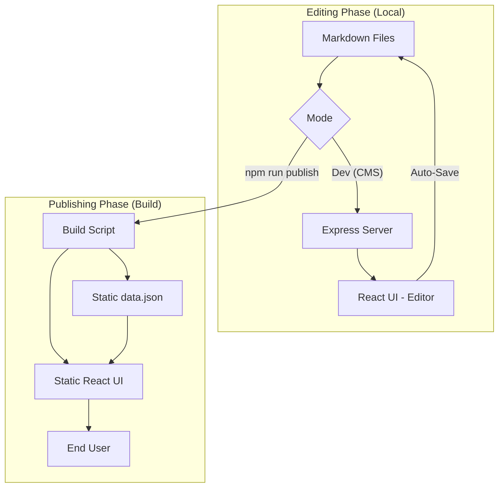
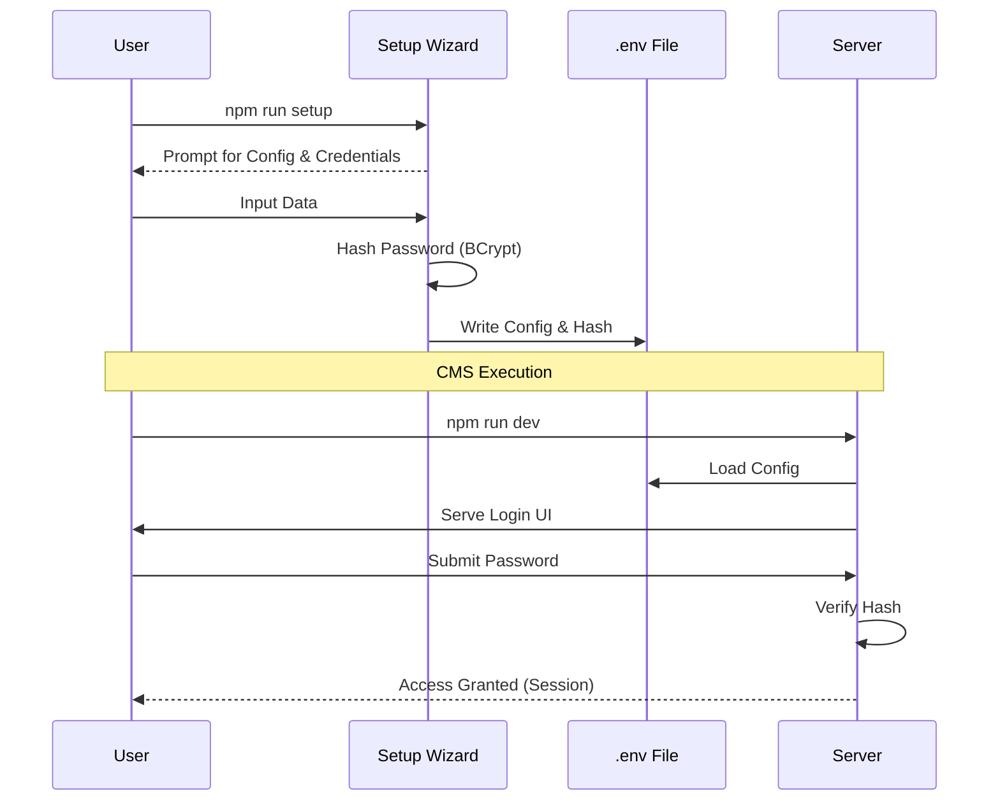
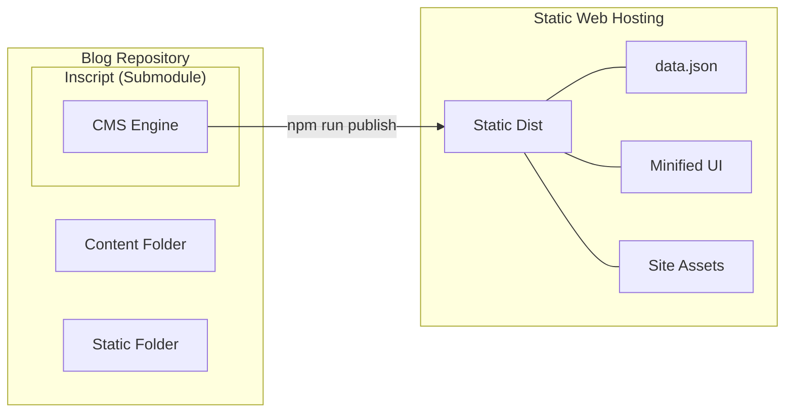

# Inscript

A unified system that helps you write and publish your markdown-based blog. A modern, "plug and play" CMS built with React, Vite, Express, and Tailwind CSS.
Designed to be a seamless submodule for any static site generator (Hugo, Astro, Next.js, etc.).

## 🎮 Live Demo
Try the editor in your browser without installing anything!
[**Launch Live Demo**](https://inscript.harshankur.com/inscript/inscript_demo.html)

**Demo Credentials**: `demo` / `demo`

> **Note**: The demo runs entirely in your browser using `localStorage`. No data is sent to a server.


## Features

### 🛡️ Production-Grade Security
-   **Local Auth**: Secure your CMS with a local username and password.
-   **BCrypt Hashing**: Passwords are securely hashed using industry-standard BCrypt.
-   **Session Management**: Secure, HTTP-only session cookies with 24-hour persistence.
-   **Interactive Logout**: Robust logout flow with a confirmation modal to prevents accidental sign-outs.

### 📝 Rich Text Editor
-   **Tiptap Power**: A Notion-style editor with slash commands (`/`) for quick formatting.
-   **Formatting**: Bold, Italic, Underline, Strike, Sub/Superscript, Alignment, and Code Blocks.
-   **Visuals**:
    -   **Images**: Drag & drop upload, resize, and extensive media library integration.
    -   **YouTube**: Embed videos directly via URL or search.
    -   **Highlights**: Multi-color highlighting text.
-   **WYSIWYG**: The look and feel of the CMS is exactly the same as the published blog. It is essentially the same application, ensuring there are no surprises in the final UI.

### 🗂️ Organization & Metadata
-   **Taxonomy**: Manage Tags and Categories with an intuitive UI.
-   **Frontmatter**: Automatically syncs YAML frontmatter (title, date, tags, etc.).
-   **Advanced Filtering**: Filter posts by tags, categories, draft status, and date ranges.

### 💾 Robust Workflow
-   **Draft System**:
    -   **Auto-Save**: Never lose work with continuous local saving.
    -   **History Stack**: Detailed undo/redo history that persists across sessions.
    -   **Conflict Resolution**: Detects if a file was modified externally.
-   **Publishing Flow**:
    -   **Save**: Updates the markdown file locally.
    -   **Publish**: Generates a static API (`data.json`) for your frontend.
    -   **Commit & Push**: (Optional) Commits changes to Git and pushes to your remote repo directly from the UI.

### 🛠️ Architecture
-   **FileSystem Based**: 100% flat-file based. No database required.
-   **Headless**: Generates a framework-agnostic `data.json` that any frontend can consume.
-   **Hybrid Mode**:
    -   **Dev**: Runs an Express server for file I/O.
    -   **Prod**: Builds to a static React app for readonly viewing.

## Installation

This tool is best installed as a **Git Submodule** within your blog's repository.

### 1. Add Submodule
Run this from your project root:

```bash
git submodule add <repository-url> inscript
```

### 2. Install & Setup
Navigate to the Inscript folder and run the interactive setup wizard:

```bash
cd inscript
npm install
npm run setup
```

The wizard will guide you through:
-   Configuring your blog identity.
-   Setting up your content and static directories.
-   Enabling authentication and setting your secure credentials.

> [!TIP]
> **Forgot your credentials?**
> If you lose access, simply open your `.env` file and delete the `AUTH_USERNAME` and `AUTH_PASSWORD_HASH` lines. The next time you run `npm run dev` or `npm run setup`, you will be prompted to create new credentials.

## 🐳 Docker Support

You can run Inscript entirely through Docker for a consistent and isolated environment.

### 1. Simple Start
If you just want to see it running, simply run:
```bash
docker-compose up -d
```

### 🔐 Git Support (Submodule Flow)
When using Inscript as a submodule, you want Git commands (Commit/Push) to target your **Parent Blog Repository**, not just the engine.

1. **Enable Credentials**: Edit `docker-compose.yml` and uncomment the volumes for `.gitconfig` and `.ssh`.
2. **Mount Root**: Ensure the `- ../:/app/` volume is active (it is by default). This mounts your entire blog repo into the container.
3. **Identity**: The container will automatically use your host's Git identity and SSH keys.

#### 📁 Directory Structure inside Container
- **`/app`**: Your Parent Blog Repository (contains `.git`). Git commands run here.
- **`/app/inscript`**: The Inscript CMS engine. `npm run dev` runs here.
- **`/app/content`**, **`/app/static`**: Your blog data folders.

> [!IMPORTANT]
> The Docker image is pre-configured to trust the `/app` directory (`git config safe.directory`), allowing seamless operations on the mounted blog repo even if file ownership differs between Host and Container.
Inscript will detect it is running in Docker and **automatically generate** a `.env` file with safe defaults (`admin`/`admin` credentials) if one is missing.

### 2. Manual Configuration
For full control, copy the example template first:
```bash
cp .env.example .env
```
Then edit `.env` and run `docker-compose up`.

> [!IMPORTANT]
> **Docker Bind Mounts**: If you run `docker-compose up` without a `.env` file existing on your host machine, Docker may create a *directory* named `.env` instead of a file. If this happens, delete the directory and create an empty `.env` file before restarting.

## Usage

### Development (Writing Content)
Run Inscript locally alongside your blog generator:

```bash
npm run dev
```
-   **Inscript Interface**: `http://localhost:5173`
-   **API Server**: `http://localhost:2221` (default)

### Publishing (Building for Production)
When you deploy your site, you need to build the Inscript assets and generate the content API.

```bash
npm run publish
```

#### What `npm run publish` does:
1.  **Setup**: Generates `public/robots.txt` and `public/manifest.json` based on your configuration.
2.  **Build UI**: Builds the React app in `readonly` mode (no editing features).
3.  **Generate Data**: Parses all markdown files and creates a `dist/data.json` for your frontend.
4.  **Sitemap**: Generates a SEO-ready `sitemap.xml`.
5.  **Assets**: Copies all images from `STATIC_DIR` to `DIST_DIR`.

## Deployment

### Netlify
To deploy this alongside your site on Netlify, add this to your **root** `netlify.toml`:

```toml
[build]
  # Adjust 'base' if your structure is different
  # This command builds the Inscript and outputs it to 'dist'
  command = "cd inscript && npm install && npm run publish"
  publish = "dist"
```

## 🏗️ System Architecture

### Content Lifecycle & Modes
Inscript operates in two distinct modes depending on your workflow stage.



### Security & Setup Flow
Behind the scenes, the setup wizard secures your environment before the CMS even starts.



### Deployment Strategy
Inscript is designed to follow a "Submodule-first" architecture, generating a headless API for your frontend.



### Deployment Environment Variables
When deploying to a provider like Netlify or Vercel, you must configure the following Environment Variables in their dashboard.

The build script `npm run setup` validates these before building.

| Variable | Required | Description | Example Value |
| :--- | :--- | :--- | :--- |
| `TITLE` | **Yes** | The blog title (used in Manifest). | `My Tech Blog` |
| `SITE_URL` | **Yes** | Public URL (used in Sitemap/Robots). | `https://example.com` |
| `CONTENT_DIR` | **Yes** | Relative path to markdown content. | `../content` |
| `STATIC_DIR` | **Yes** | Relative path to source images/assets. | `../static` |
| `DRAFTS_DIR` | **Yes** | Path for drafts and version history. | `../drafts` |
| `DIST_DIR` | No | Override build output location. | `../dist` |
| `FAVICON` | No | Path to custom favicon in Static Dir. | `favicon-32x32.png` |
| `SERVER_PORT` | No | Port for the backend API server. | `2221` |
| `CLIENT_PORT` | No | Port for the frontend React app (Dev). | `2222` |
| `ALLOWED_HOSTS` | No | Comma-separated allowed hosts for backend. | `blog.me.com` |
| `AUTH_ENABLED` | No | Enable local password authentication. | `true` |
| `AUTH_USERNAME` | No | Admin username for login. | `admin` |
| `AUTH_PASSWORD_HASH` | No | BCrypt hash of your password. | `$2b$10$...` |
| `SESSION_SECRET` | No | Secret for signing session cookies. | `(any random string)` |
| `ALLOW_PUSH` | No | Enable Git Push from UI (Dangerous). | `false` |

### Advanced Build Configuration
If you need to change **where** the site is built (e.g. if your hosting provider expects a specific folder name like `public` or `build`), you can override the output directory using `DIST_DIR`.

1.  **Set the Variable**: In your hosting dashboard (Netlify/Vercel settings), add:
    ```env
    DIST_DIR=./build_output
    ```
    *(Note: This path is relative to the `inscript` folder)*

2.  **Update Publish Settings**: Ensure your hosting provider is configured to publish that same directory.
    *   **Netlify**: Update `publish = "inscript/build_output"` in `netlify.toml` or UI.
    *   **Vercel**: Update "Output Directory" in settings.

**Critical**: The `DIST_DIR` variable tells the build script where to put files. The Hosting Provider's "Publish Directory" setting tells the server which folder to serve. **These must match.**

### Self-Hosted
Serve the contents of the `DIST_DIR` (default `../dist` relative to Inscript) using Nginx, Apache, or any static file server.

## 🔐 Enabling Git Commit & Push

Inscript can handle your entire version control workflow. By default, **Push** is disabled for safety.

### 1. Enable Push Feature
Open your `.env` file and set the experimental flag:
```env
ALLOW_PUSH=true
```

### 2. Configure Git Identity
Ensure your host machine has Git configured:
```bash
git config --global user.name "Your Name"
git config --global user.email "you@example.com"
```

### 3. Docker Configuration
If running via Docker, you must share your host credentials by editing `docker-compose.yml`:

```yaml
volumes:
  # Share your Git global config
  - ${HOME:-~}/.gitconfig:/root/.gitconfig:ro
  # Share your SSH keys for pushing to GitHub/GitLab
  - ${HOME:-~}/.ssh:/root/.ssh:ro
```

> [!TIP]
> **Submodule Awareness**: When Inscript is a submodule, it automatically detects the parent repository. Your commits and pushes will apply to the **Parent Blog Repository**, keeping your content and engine perfectly synced.

## Troubleshooting

-   **"Missing setup script"**: Ensure you run `npm run setup` if you accidentally deleted generated files.
-   **"Network Error"**: Make sure the backend server (port 3001) is running if you are in Dev mode.
-   **"Git Push Failed"**: 
    1. Verify `ALLOW_PUSH=true` is set in `.env`.
    2. If using Docker, ensure `.ssh` and `.gitconfig` volumes are correctly mounted and not commented out.
    3. Ensure your SSH keys are added to your SSH agent on the host.
-   **"git: not found"**: If running in Docker, you may need to rebuild your image to install Git: `docker-compose up -d --build`.

## License

MIT
